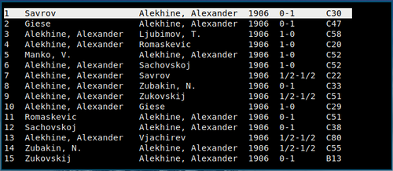
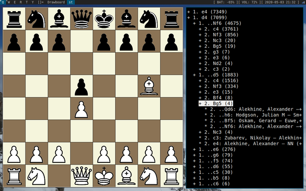
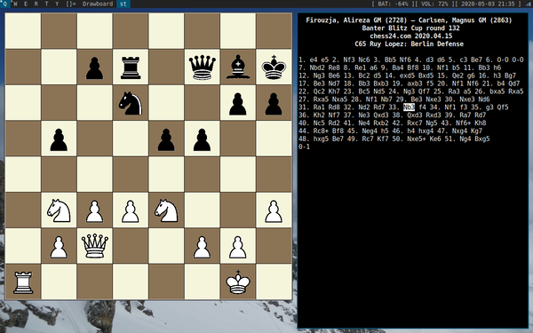

# chesstools

This package provides a suite of minimalist tools for chess study following the
UNIX philosophy. Each of the tools does only one thing and they can be easily
combined with each other as well as with other system tools using pipes.

The following tools are currently provided:
- **drawboard** reads a position in FEN notation from the standard input and
  draws it,
- **makemoves** reads moves and outputs the resulting position (also checking
  whether the moves are valid),
- **pgnvi** is a curses-based editor for PGN files, allowing for browsing,
  searching, commenting and writing games. A more elaborate description is
  given below.

The tools use existing Perl modules for manipulating chess data, namely
`Chess::Rep` and `Chess::PGN::Parse`, wherever possible.

# Installation

```
perl Makefile.PL
make
make install
```

See `Makefile.PL` for a list of dependencies. Currently the scripts are
self-contained, so they will work without installing as well (just run them),
but this may change in the future.

# pgnvi

**pgnvi** is the main component of the package. It is a text-based browser and
editor of PGN files highly inspired by the **vi** text editor.

## List view



This is the view in which **pgnvi** starts. Right now it's not very useful, but 
it will be when the planned searching and filtering functionalities are
implemented.

### Keybindings

* **g**/**G** - go to beginning/end
* **j**/**k** - go down/up
* **t** - open tree view
* **<Enter>** - open game
* **q** - quit program

## Tree view



The tree view can be used as an opening explorer. It is particularly useful for
browsing large databases.

### Keybindings

* **g**/**G** - go to beginning/end
* **j**/**k** - go down/up
* **l**/**h** - expand/collapse node
* **b** - toggle board
* **<Space>**/**<Enter>** (on a non-leaf node) - toggle expand/collapse node
* **<Enter>** (on a leaf node) - open game
* **q** - quit the tree view

## Game view



The game view is used for viewing and editing a single game.

### Keybindings

* **g**/**G** - go to beginning/end
* **j**/**k** - go one move forward/back
* **b** - toggle board
* **y** - yank the current position to X selection (requires `xclip`)
* **a** - enter append mode
* **A** - delete all moves behind the cursor and enter append mode
* **u** - undo the latest delete/append
* **s** - save PGN (**OVERWRITES WITHOUT ASKING**)
* **q** - quit the game view

### Append mode

**pgnvi** does not provide a true "insert mode", in which you could edit
arbitrary chunks of the game. This is because the move sequence has to remain
correct, so editing something in the middle makes little sense and would be
difficult to implement. Instead, an "append mode" is provided, in which you can
append the moves to the end of the sequence.

In the append mode, the following bindings are used:

* **<Backspace>** - delete the last character
* **<Space>** - append the current move and move on to the next one
* **<Enter>** - leave append mode

Moves are input using the keyboard, but in a highly non-standard layout, which
looks like this:
```
+-----+-----+-----+-----+-----+-----+-----+-----+-----+-----+
|  1  |  2  |  3  |  4  |  +* | O-O*|  5  |  6  |  7  |  8  |
+-----+-----+-----+-----+-----+-----+-----+-----+-----+-----+
 |  a  |  b  |  c  |  d  |     |     |  e  |  f  |  g  |  h  |
 +-----+-----+-----+-----+-----+-----+-----+-----+-----+-----+
  |  R  |  N  |  B  |  Q  |     |  x  |  K  |  B  |  N  |  R  |
  +-----+-----+-----+-----+-----+-----+-----+-----+-----+-----+
```

\*) furthermore, **<Shift>-T** gives `#` (checkmate) and **<Shift-Y>** gives
`O-O-O` (queenside castle).

The home row index finger keys (F/J on standard US keyboard) are thus bound to
"d/e". For example, the move `Nf3` would be input by the key sequence `.ke` or
`xke` on US keyboard. Notice that the numbers are not where they normally are,
but one row below, that is in QWERTYUIOP row.

While such layout might be very unfamiliar at the beginning, it quickly pays
off to learn it. Notice how the bottom two rows of each hand perfectly
correspond to queenside/kingside. A move almost always (with the exception of
castling) consists of at least one home row key followed by one above-home row
key - which are the easiest keys to reach. Of course you can use either
rook/knight/bishop key to move either rook/knight/bishop. Notice that you
always use the same finger for a specific piece, regardless of which hand
you're using (e.g. the ring finger for the knight).

After typing in a move, simply press space to proceed to the next one. The move
numbers will be filled in automatically. The append mode only accepts valid and
unambiguous moves in the respective position, so if you press space and the
cursor does not advance to the next move, it is because the current move is
invalid or ambiguous. However, the marking of checks (`+`) and capturing (`x`)
is optional. Press Enter to finish appending moves (note: the currently edited
move will not be appended).

The `=` needed for pawn promotion (e.g. `e8=Q`) is currently in its usual
place, but this may change.

# Pipe examples

The smaller tools in the package can be used for command-line hacking. The
simplest useful pipe is:
```
makemoves | drawboard
```
which allows for typing in moves and seeing them on the board.

When using such pipes interactively, beware of the buffering of I/O streams,
which will prevent the next tool in the pipe from receiving the input
immediately. Some system tools have flags to disable buffering, for example
`sed -u`.

The following pipe reads the move using Polish piece abbreviations, e.g. G =
goniec = bishop (admittedly not very useful, but why not...):

```
sed -u 'y/KHWGS/KQRBN/' | makemoves | drawboard
```

For non-interactive and non-subprocess use, e.g. if you want to see one
specific position, you might want to use `drawboard` with the `-l` flag, which
will prevent it from terminating when the input stream is closed:
```
echo "d4 Nf6 c4 e6 Nf3 b6 e3 Bb7" | makemoves | drawboard -l
```

If you want to maintain a history of seen positions while moving the pieces
around, for example to be able to revert to a previous one, you only need to
pipe through `tee`:
```
makemoves | tee positions.txt | drawboard
```

If you enter a valid FEN position into `makemoves`, it will reset to it and
output it.

## TODO

**pgnvi:**

- non-standard starting positions (the `FEN` tag)
- metadata editing
- comments
- variants
- searching and filtering game lists
- fixing numerous bugs
- rebinding keys (including the append mode keyboard)
- customizability in general
- more user-friendly UI
- (?) interface to UCI chess engines (e.g. Stockfish)
- much more...

**drawboard:**

- some rudimentary customization, e.g. square colors

# Disclaimer / Caution

The software is currently in alpha stage and might be unstable. Please backup
all files you're working with. Especially, **if you open a file that contains
unsupported elements (like comments or variants) and use the "save" option,
they will be lost without a warning**. Obviously, this is considered a bug and
will be fixed soon.

# Acknowledgements

The chess piece images were taken from
[Wikimedia Commons](https://commons.wikimedia.org/wiki/File:Chess_Pieces_Sprite.svg)
and are work of the user Cburnett.

# Author

Maciej Janicki <mail(at)macjanicki.eu>, 2020

